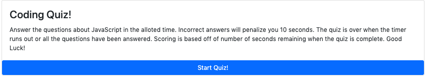

[Installation]
To get this webpage running, visit the website at https://obrienceob.github.io/CodeQuiz/

If it is not on a github repository yet, you'll need a text editor. I reccomend VS Code. Download the zip file or code, or use GitHub's instructions to create a new repo. Uplaod the index.html, Highscores.html, and assets folder containing the style.css, script.js, and highscoreScript.js files to github using the git add, commit, and push commands.

Then ensure the file uploaded, open up the setting in your repo, and scroll down to the pages section. Change the source to "main" or "master" and save. 

[Usage]
Click the start quiz button to start the workflow. Answer the questions within the alloted time to take the quiz. 

Once the quiz is complete, your score will be displayed as the seconds remaining. Time will be removed from the timer for incorrect answers, imapcting the final score.

Here is a screenshot of the quiz:

[Code]

This project contains a html file with a basic card with a button in it to start the quiz. It has a CSS page with some basic styling, and leveraged bootstrap.
The javascript code defines the quiz and highscores functions. 

There are variables for user inputs. 

It contains event listeners for the clicks on the buttons. 

The functions contain API calls to complete the quiz 

    

[Credits]

Author of code: Conor O'Brien

Following tutorials available here: 
    https://www.w3schools.com/
    https://developer.mozilla.org/en-US/docs/Web/JavaScript/Guide/Loops_and_iteration
    https://www.youtube.com/watch?v=pQr4O1OITJo

[License]

MIT License

Copyright (c) [2020] [Conor O'Brien]

Permission is hereby granted, free of charge, to any person obtaining a copy
of this software and associated documentation files (the "Software"), to deal
in the Software without restriction, including without limitation the rights
to use, copy, modify, merge, publish, distribute, sublicense, and/or sell
copies of the Software, and to permit persons to whom the Software is
furnished to do so, subject to the following conditions:

The above copyright notice and this permission notice shall be included in all
copies or substantial portions of the Software.

THE SOFTWARE IS PROVIDED "AS IS", WITHOUT WARRANTY OF ANY KIND, EXPRESS OR
IMPLIED, INCLUDING BUT NOT LIMITED TO THE WARRANTIES OF MERCHANTABILITY,
FITNESS FOR A PARTICULAR PURPOSE AND NONINFRINGEMENT. IN NO EVENT SHALL THE
AUTHORS OR COPYRIGHT HOLDERS BE LIABLE FOR ANY CLAIM, DAMAGES OR OTHER
LIABILITY, WHETHER IN AN ACTION OF CONTRACT, TORT OR OTHERWISE, ARISING FROM,
OUT OF OR IN CONNECTION WITH THE SOFTWARE OR THE USE OR OTHER DEALINGS IN THE
SOFTWARE.

